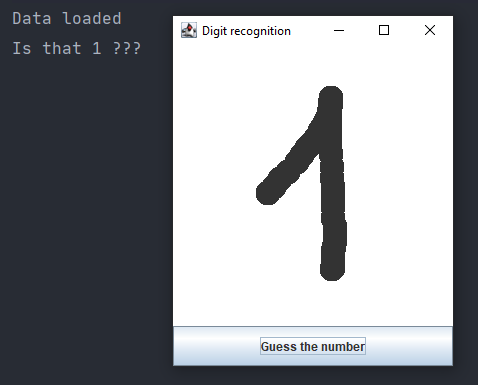

# NumberGuesser

This was a one-day project with a goal to make something useful with the basic 
knowledge of machine learning. 

The project uses:
 - Kotlin
 - No additional libraries
 - MNIST dataset
 - Java swing library for drawing
 - K-NN algorithm for detecting which digit has been drawn

# Before you run it
Before you run the program you have to extract the images. You can do that by runnig PrepareData.kt file.
(You might have to create the folders for those images e.g. resources/images/0, resources/images/1, ...)

# How does it work
You just simply run the program and swing window should pop-up, then draw something
in the white area and press the button to perform the algorithm. When the algorithm finishes
the result should be visible in the console. (The program might need a few seconds to load all the image data,
so don't be surprised that the UI freezes after you pressed the button for the first time, because it waits for the data to load.
Luckily, after those few seconds everything should work smoothly.)

### It should look something like that:

